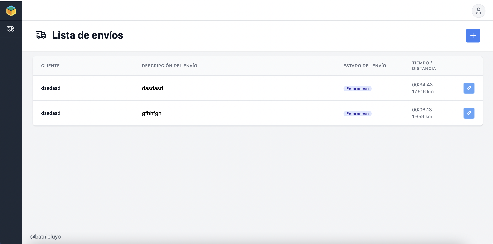

# Pre-requisites

* node v12.22.1
* npm 
* mysql
* sequelize-cli

# Install

```
# Edit the .env file using yours db credentials
cp .env.example .env

# Then run we need create the database and run seeders
npm run database
 
# Finally start the project 
# - You can run `npm run start` if the packages are already installed

npm install && npm run start
```

# Preview


